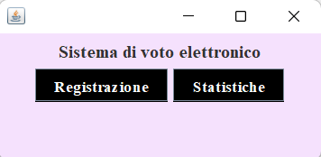
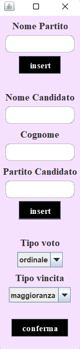
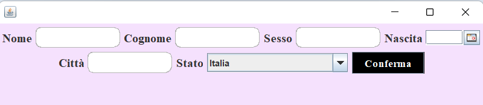
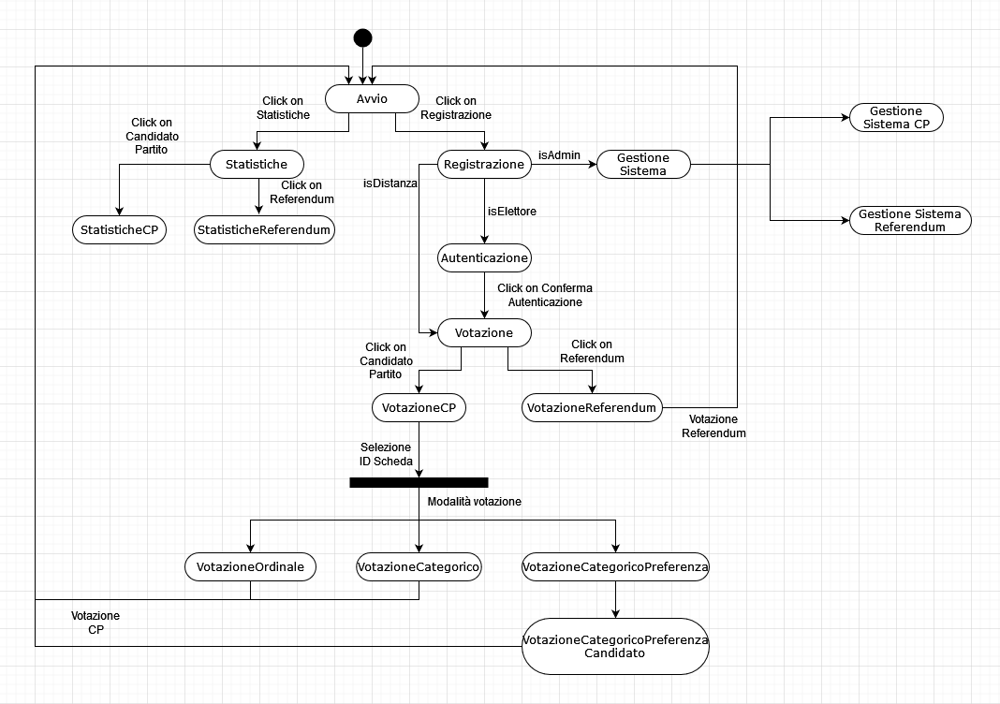
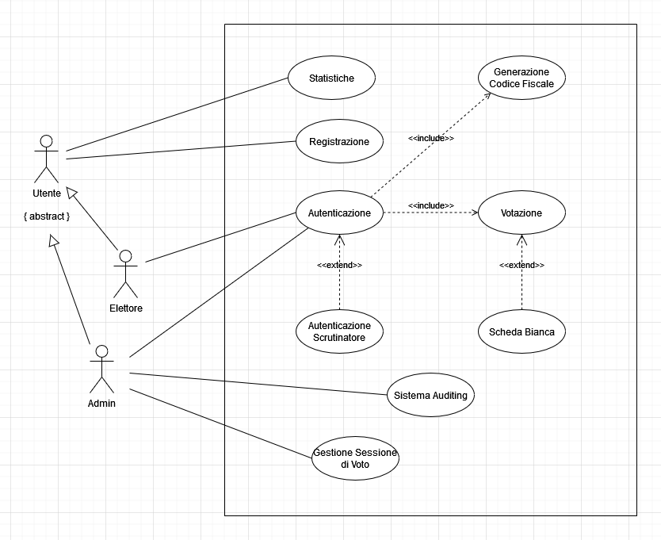
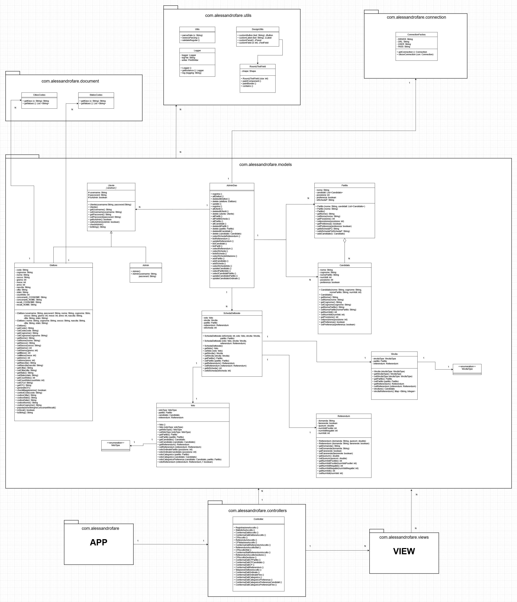
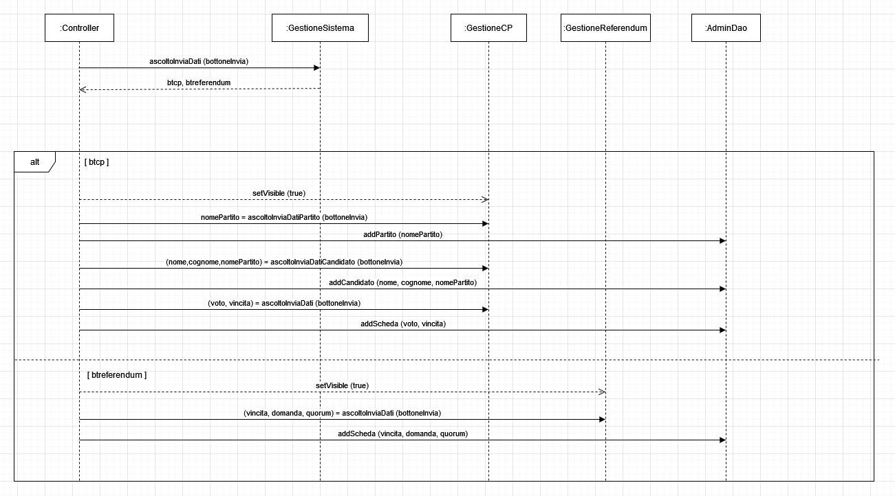
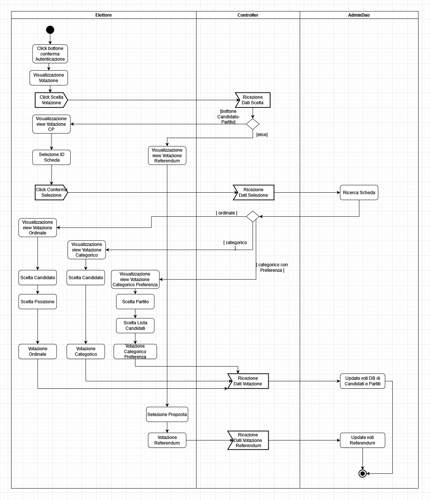
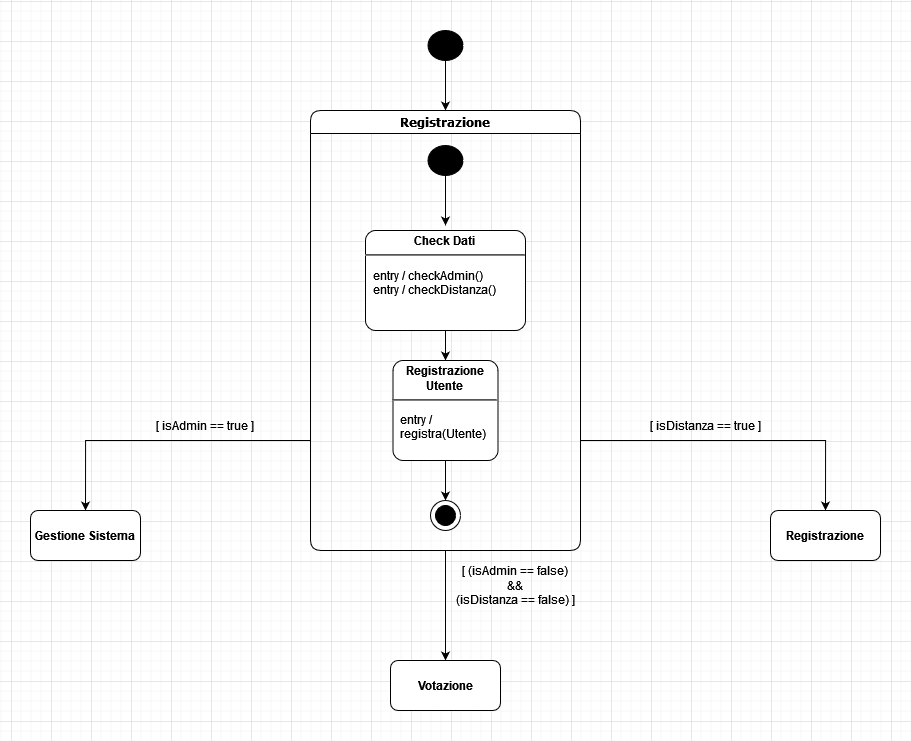
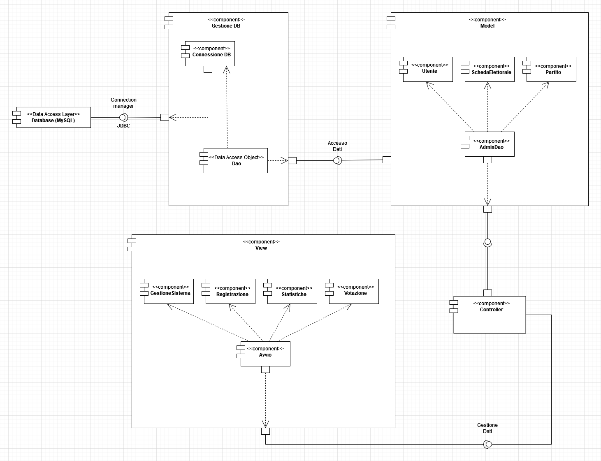

# VotoElettronico

Electronic Voting System and Ballot box made with Java and MySQL.

* You can register and configure voting session or vote in the election or referendum.
* There are two types of Users: elector and admin.
* The project is implemented with 4 design patterns: MVC, DAO, Observer and Singleton.
* The GUI is made with Java Swing.

## Docs

[VotoElettronico_Docs](https://github.com/AlessandroFare/VotoElettronico/blob/master/Docs_VotoElettronico.pdf)

## Built with:

* [Java](https://www.java.com/it/)
* [MySQL](https://www.mysql.com/it/)

## Project

All GUI and UML Diagram images are on images folder.

### Avvio

### Gestione Elezioni

### Registrazione Elettore

### Navigation Map

## UML Diagram

### Use Case

### Class Diagram

### Sequence Diagram (Gestione Sessione di Voto)

### Activity Diagram (Votazione)

### FSM Diagram (Registrazione)

### Component Diagram

## Prerequisites

You have to install MySQL DBMS to import my dumps.\
Connector file .jar is already in this repo.

## Usage

Open Voto-Elettronico on Eclipse as a project.\
Click on project -> properties > java build path > Add external files jar.\
Then add the two files .jar on the libs folder.\
Finally run VotoElettronico.java.

## Author

* **Alessandro Farè**
